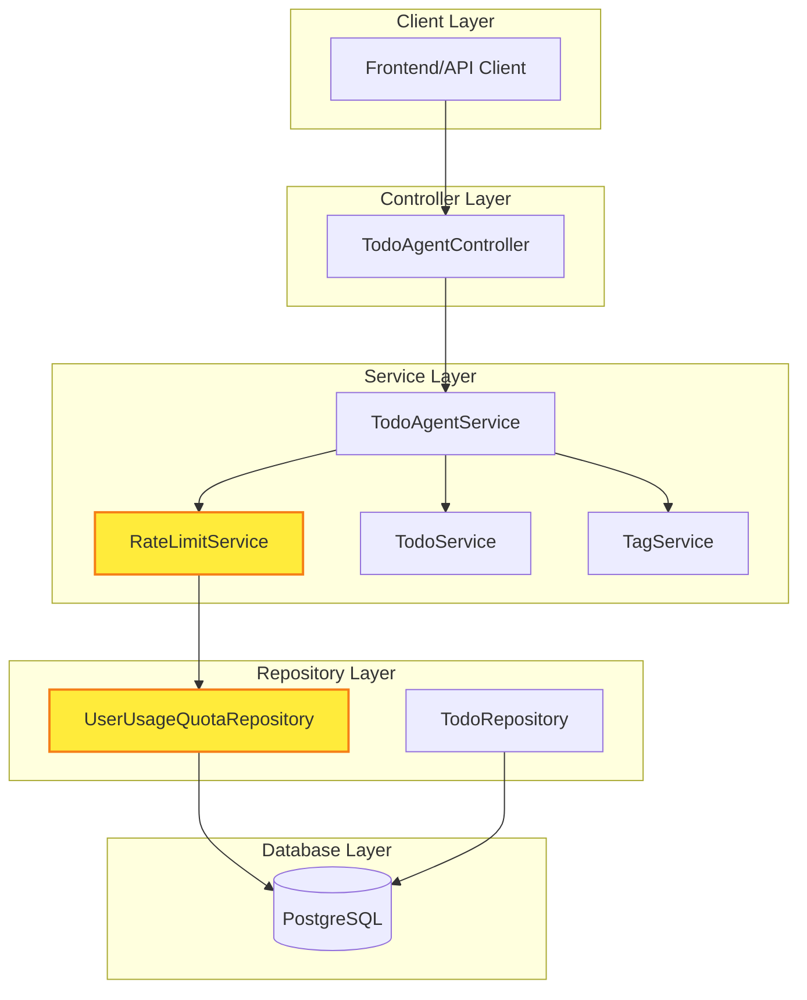
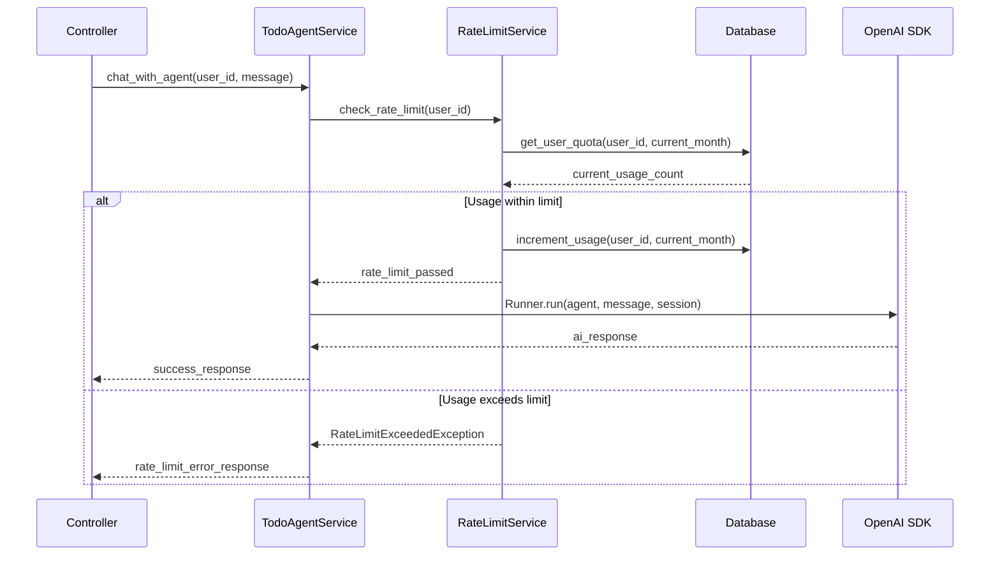
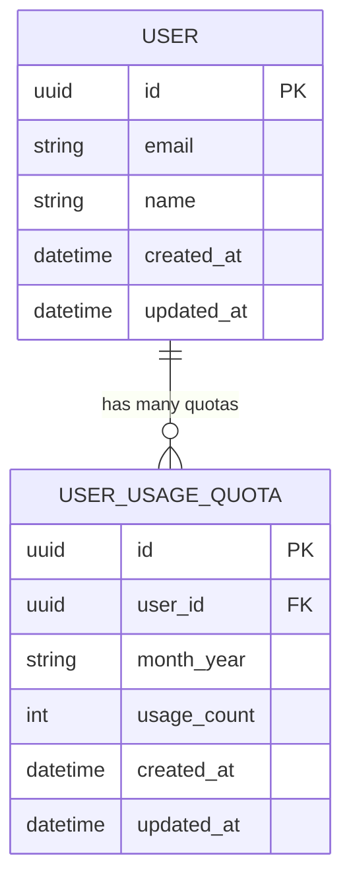
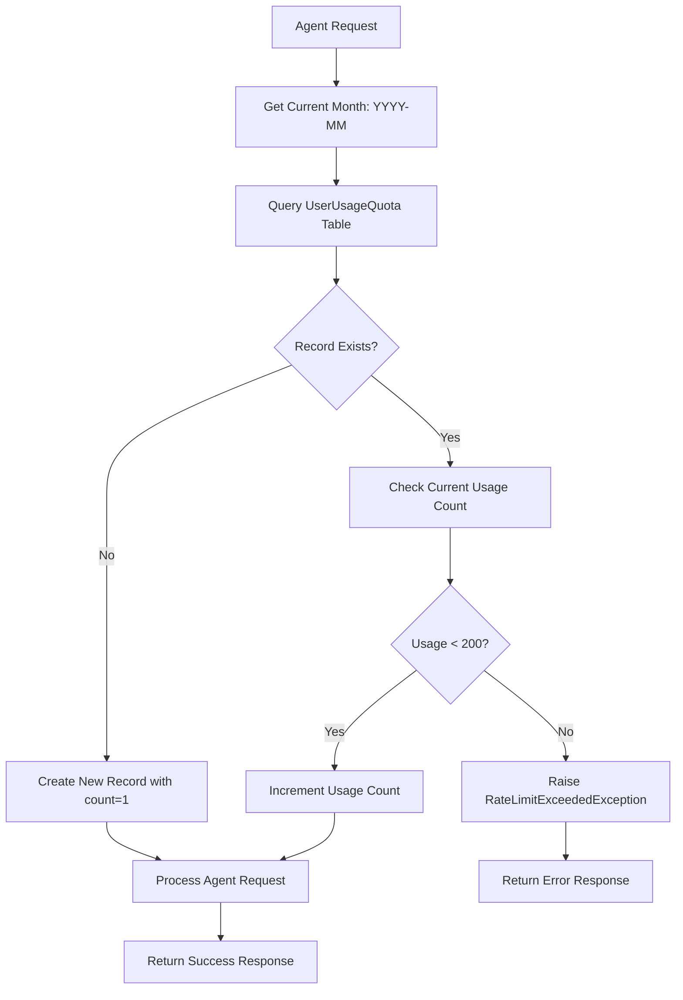
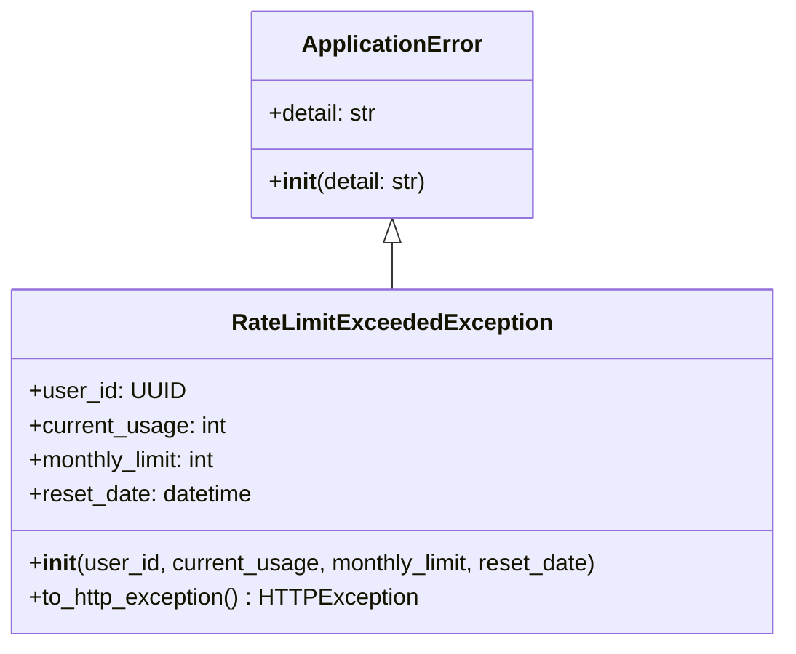
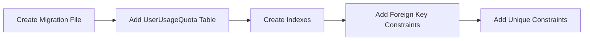
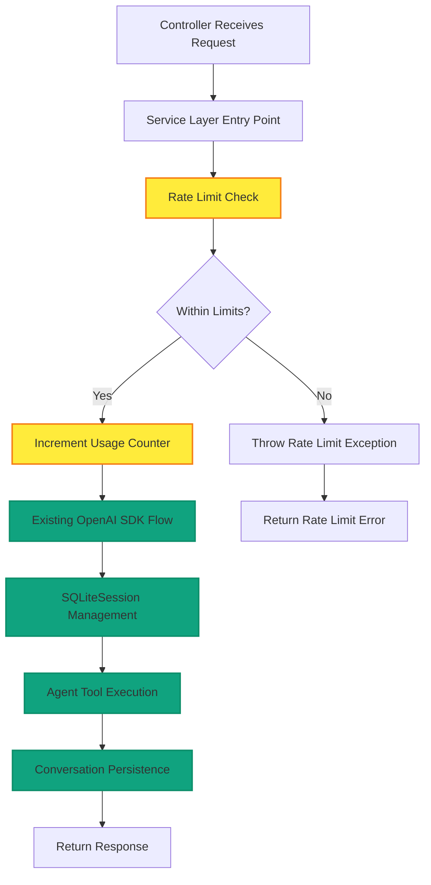
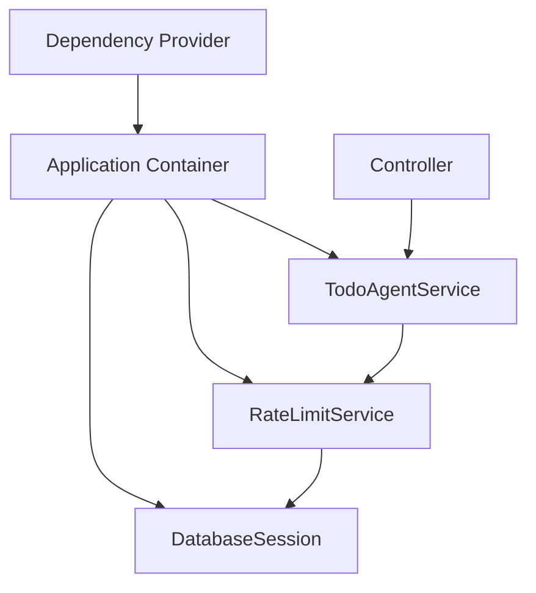
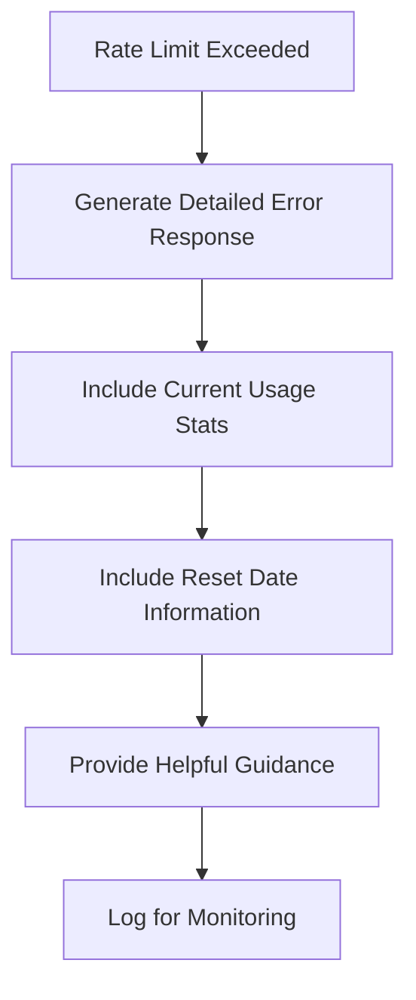

# Rate Limiting for Backend Agent Requests

## Overview

This design document outlines the implementation of a rate limiting system for AI agent requests in the Putian AI Todo Backend. The system will enforce a monthly quota of 200 agent requests per user to manage resource usage and prevent abuse while maintaining the existing OpenAI SDK integration.

The rate limiting system will be seamlessly integrated into the existing clean architecture pattern, using the domain-driven design approach already established in the codebase.

## Architecture

### System Integration Point

The rate limiting functionality will be integrated at the service layer, specifically intercepting calls to the `TodoAgentService.chat_with_agent` method. This approach ensures:

- Minimal disruption to existing OpenAI SDK integration
- Consistent rate limiting across all agent interaction endpoints
- Proper separation of concerns within the clean architecture



### Rate Limiting Flow



## Data Models & ORM Mapping

### UserUsageQuota Model



The `UserUsageQuota` model will track monthly agent request usage:

- **user_id**: Foreign key reference to the User model
- **month_year**: String in format "YYYY-MM" to identify the tracking period
- **usage_count**: Number of agent requests made in the specified month
- **Unique constraint**: Combination of user_id and month_year ensures one record per user per month

## Business Logic Layer

### RateLimitService

The rate limiting service will provide the following core functionalities:

#### Core Methods

| Method | Purpose | Parameters | Returns |
|--------|---------|------------|---------|
| `check_and_increment_usage` | Validates and records agent request | user_id: UUID, session: AsyncSession | None (raises exception if limit exceeded) |
| `get_user_usage_stats` | Retrieves current usage statistics | user_id: UUID, session: AsyncSession | UsageStats object |
| `get_remaining_quota` | Calculates remaining requests for current month | user_id: UUID, session: AsyncSession | int |

#### Rate Limiting Logic



### Exception Handling

Custom exception class for rate limit violations:



## API Integration

### Modified TodoAgentService

The existing `TodoAgentService.chat_with_agent` method will be enhanced to include rate limiting:

#### Before Rate Limiting
```python
async def chat_with_agent(self, user_id: str, message: str, session_id: str | None = None) -> str:
    # Direct processing without rate limiting
    # Set context and run agent
```

#### After Rate Limiting Integration
```python
async def chat_with_agent(self, user_id: str, message: str, session_id: str | None = None) -> str:
    # Rate limiting check before processing
    # Increment usage if within limits
    # Process agent request
    # Return response
```

### Response Schema Extensions

Enhanced error responses for rate limiting scenarios:

| Field | Type | Description |
|-------|------|-------------|
| `status` | string | "error" for rate limit violations |
| `message` | string | Human-readable error message |
| `error_code` | string | "RATE_LIMIT_EXCEEDED" |
| `current_usage` | integer | Number of requests used this month |
| `monthly_limit` | integer | Maximum requests allowed per month (200) |
| `reset_date` | string | ISO datetime when quota resets |
| `remaining_quota` | integer | Requests remaining this month |

### Usage Statistics Endpoint

New endpoint for users to check their current usage:

```
GET /api/v1/todo-agents/usage-stats
```

Response structure:
```json
{
  "status": "success",
  "current_month": "2025-01",
  "usage_count": 45,
  "monthly_limit": 200,
  "remaining_quota": 155,
  "reset_date": "2025-02-01T00:00:00Z"
}
```

## Database Migration

### Migration Script Structure



Migration details:
- **Table**: `user_usage_quota`
- **Primary Key**: UUID-based ID following existing pattern
- **Indexes**: Composite index on (user_id, month_year) for efficient lookups
- **Foreign Key**: References user_account.id with CASCADE delete
- **Unique Constraint**: Prevents duplicate records for user-month combinations

## Integration with OpenAI SDK

### Preservation of Existing Functionality

The rate limiting implementation will maintain full compatibility with the existing OpenAI SDK integration:

#### Session Management
- **No changes** to SQLiteSession usage pattern
- **No changes** to conversation history persistence
- **No changes** to Runner.run() method calls

#### Tool Integration
- **No changes** to agent tool definitions
- **No changes** to tool context management
- **No changes** to tool implementation patterns

#### Agent Factory
- **No changes** to agent creation and configuration
- **No changes** to LiteLLM model integration

### Rate Limiting Integration Points



## Configuration Management

### Environment Variables

| Variable | Default | Description |
|----------|---------|-------------|
| `RATE_LIMIT_MONTHLY_QUOTA` | 200 | Maximum agent requests per user per month |
| `RATE_LIMIT_ENABLED` | true | Enable/disable rate limiting globally |

### Dependency Injection Updates

The rate limiting service will be integrated into the existing dependency injection system:



## Testing Strategy

### Unit Tests

#### RateLimitService Tests
- Test quota enforcement logic
- Test usage counter increment
- Test month rollover behavior
- Test exception handling scenarios

#### Integration Points Tests
- Test service integration with TodoAgentService
- Test database operations
- Test error response formatting

### Test Scenarios

| Scenario | Expected Behavior |
|----------|-------------------|
| First request of month | Creates new quota record, allows request |
| Request within limit | Increments counter, allows request |
| Request at limit (200th) | Increments to 200, allows request |
| Request over limit (201st) | Throws RateLimitExceededException |
| New month rollover | Creates new quota record for new month |
| Database unavailable | Graceful degradation or error handling |
| Invalid user ID | Appropriate error response |

### Performance Testing

- Load testing with concurrent requests from same user
- Verification of database query performance
- Memory usage analysis for quota tracking

## Error Handling & User Experience

### Error Response Strategy



### User-Friendly Error Messages

- Clear explanation of the rate limit
- Information about when the quota resets
- Guidance on usage patterns
- Contact information for quota increase requests

## Security Considerations

### User Isolation
- Rate limits are enforced per user ID
- No cross-user quota sharing
- Secure user identification through existing authentication

### Quota Tampering Prevention
- Database-level constraints prevent manipulation
- Atomic increment operations ensure consistency
- Audit trail through created_at/updated_at timestamps

### DoS Protection
- Rate limiting itself prevents agent request flooding
- Database connection pooling protects against connection exhaustion
- Efficient indexing prevents slow queries under load

## Performance Optimization

### Database Query Optimization
- Composite index on (user_id, month_year) for fast lookups
- Prepared statements for repeated queries
- Connection pooling for concurrent access

### Caching Strategy
- Consider in-memory caching for frequently accessed quotas
- Cache invalidation on quota updates
- Redis integration for distributed scenarios (future enhancement)

### Memory Efficiency
- Minimal memory footprint for quota tracking
- Efficient data structures for usage statistics
- Cleanup of old quota records (optional retention policy)