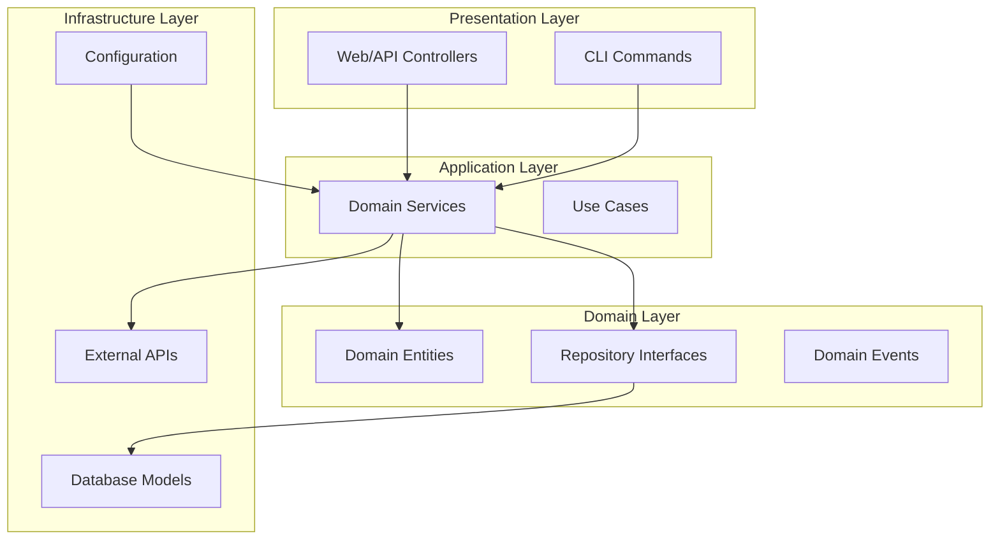
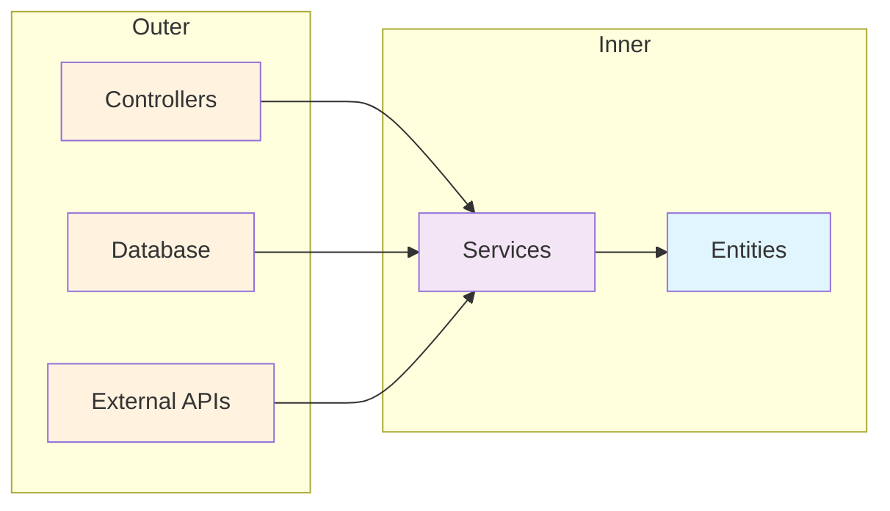

# Clean Architecture Principles

This document outlines how the Putian AI Todo Backend implements Clean Architecture principles to maintain separation of concerns, testability, and maintainability.

## Table of Contents

- [Architecture Overview](#architecture-overview)
- [Layer Structure](#layer-structure)
- [Dependency Direction](#dependency-direction)
- [Domain-Centric Architecture](#domain-centric-architecture)
- [Dependency Injection](#dependency-injection)
- [Framework Integration](#framework-integration)
- [Testing Strategy](#testing-strategy)
- [SOLID Principles](#solid-principles)

## Architecture Overview

This Litestar application follows Clean Architecture principles with clear separation between layers, ensuring that business logic remains independent of external concerns like frameworks, databases, and external APIs.



## Layer Structure

### 1. Domain Layer (`src/app/domain/`)

The domain layer contains the core business logic and is completely independent of frameworks and external infrastructure.

#### Structure:
```
src/app/domain/
├── accounts/           # User management domain
│   ├── controllers/    # HTTP controllers
│   ├── services.py     # Business logic
│   ├── schemas.py      # Data transfer objects
│   └── deps.py         # Dependency providers
├── todo/              # Todo management domain
│   ├── controllers/
│   ├── services.py
│   ├── schemas.py
│   └── deps.py
├── todo_agents/       # AI agent domain
│   ├── controllers/
│   ├── services.py
│   ├── tools/         # Agent tool definitions
│   └── deps.py
├── agent_sessions/    # Agent session management
├── quota/            # Usage quota management
└── system/           # System-level operations
```

#### Key Characteristics:

**Business Entity Example:**
```python
# src/app/domain/todo/services.py
class TodoService(SQLAlchemyAsyncRepositoryService[m.Todo]):
    """Handles database operations for todo."""

    class Repository(SQLAlchemyAsyncRepository[m.Todo]):
        """Todo SQLAlchemy Repository."""
        model_type = m.Todo

    repository_type = Repository
    match_fields = ["item"]

    async def check_time_conflict(
        self,
        user_id: UUID,
        start_time: datetime,
        end_time: datetime,
        exclude_todo_id: UUID | None = None
    ) -> list[m.Todo]:
        """Business logic for time conflict detection."""
        filters = [
            m.Todo.user_id == user_id,
            m.Todo.start_time < end_time,
            m.Todo.end_time > start_time,
        ]
        if exclude_todo_id:
            filters.append(m.Todo.id != exclude_todo_id)

        conflicts, _ = await self.list_and_count(*filters)
        return list(conflicts)
```

**Domain Schema Example:**
```python
# src/app/domain/todo/schemas.py
class TodoModel(PydanticBaseModel):
    id: UUID
    item: str
    description: str | None = None
    created_time: datetime
    start_time: datetime
    end_time: datetime
    importance: Importance
    user_id: UUID
    tags: list[str] | None = None

    @field_validator("tags", mode="before")
    @classmethod
    def _extract_tag_names(cls, value: Any) -> list[str] | None:
        """Domain-specific validation logic."""
        # Business rules for tag validation
        if value is None:
            return None
        # ... validation logic
```

### 2. Infrastructure Layer (`src/app/db/`, `src/app/lib/`)

The infrastructure layer handles technical concerns like databases, external APIs, and framework-specific implementations.

#### Database Models (`src/app/db/models/`)

```python
# src/app/db/models/todo.py
class Todo(UUIDAuditBase):
    """Database entity representing a todo item."""

    __tablename__ = "todo"
    __table_args__ = {"comment": "Todo items"}

    item: Mapped[str] = mapped_column(String(length=100), index=True)
    description: Mapped[str] = mapped_column(String(length=1024))
    user_id: Mapped[UUID] = mapped_column(ForeignKey("user_account.id"))

    # ORM relationships
    todo_tags: Mapped[list[TodoTag]] = relationship(
        back_populates="todo", lazy="selectin"
    )
    tags: AssociationProxy[list[Tag]] = association_proxy("todo_tags", "tag")
```

#### Infrastructure Services (`src/app/lib/`)

```python
# src/app/lib/email.py
async def send_verification_email(user_email: str, token: str) -> None:
    """Infrastructure service for email sending."""
    # External email service integration
    pass

# src/app/lib/crypt.py
def verify_password(plain_password: str, hashed_password: str) -> bool:
    """Infrastructure service for password verification."""
    # Cryptographic operations
    pass
```

### 3. Presentation Layer (`src/app/domain/*/controllers/`)

Controllers handle HTTP requests and coordinate with services but contain no business logic.

```python
# src/app/domain/todo/controllers/todos.py
class TodoController(Controller):
    """Controller for managing todo items."""

    dependencies = {
        "todo_service": Provide(provide_todo_service),
        "tag_service": Provide(provide_tag_service),
    }

    @post(path="/", operation_id="create_todo")
    async def create_todo(
        self,
        current_user: m.User,
        data: TodoCreate,
        todo_service: TodoService
    ) -> TodoModel:
        """Create a new todo item."""
        todo_dict = data.to_dict()
        todo_dict["user_id"] = current_user.id
        todo_model = await todo_service.create(todo_dict)
        return todo_service.to_schema(todo_model, schema_type=TodoModel)
```

## Dependency Direction

Dependencies always point inward, following the Dependency Rule:



### Dependency Inversion Examples

**Service Depends on Abstraction:**
```python
# Service depends on repository interface, not implementation
class TodoService(SQLAlchemyAsyncRepositoryService[m.Todo]):
    class Repository(SQLAlchemyAsyncRepository[m.Todo]):
        model_type = m.Todo

    repository_type = Repository  # Dependency injection point
```

**Controller Depends on Service Interface:**
```python
# Controller depends on service abstraction
class TodoController(Controller):
    dependencies = {
        "todo_service": Provide(provide_todo_service),  # DI container provides implementation
    }
```

## Domain-Centric Architecture

The architecture is organized around business domains rather than technical layers:

### Domain Boundaries

Each domain is self-contained with its own:
- **Controllers**: HTTP interface
- **Services**: Business logic
- **Schemas**: Data contracts
- **Dependencies**: Domain-specific DI providers

**Todo Domain Example:**
```
src/app/domain/todo/
├── __init__.py
├── controllers/
│   ├── __init__.py
│   └── todos.py      # HTTP endpoints
├── services.py        # Business logic
├── schemas.py         # DTOs and models
├── deps.py           # Dependency providers
└── __init__.py
```

### Cross-Cutting Concerns

Cross-cutting concerns are handled through shared libraries and dependency injection:

```python
# src/app/lib/deps.py - Generic dependency providers
from advanced_alchemy.extensions.litestar.providers import (
    create_service_provider,
    create_filter_dependencies,
)

# Domain-specific dependency configuration
provide_todo_service = create_service_provider(
    TodoService,
    load=[
        selectinload(m.Todo.todo_tags),
        joinedload(m.Todo.user),
    ],
    error_messages={
        "duplicate_key": "This user already exists.",
        "integrity": "User operation failed.",
    },
)
```

## Dependency Injection

The application uses Litestar's built-in dependency injection container to manage dependencies and promote loose coupling.

### Service Provider Pattern

```python
# src/app/domain/todo/deps.py
from app.lib.deps import create_service_provider

# Configured service provider with specific loading strategies
provide_todo_service = create_service_provider(
    TodoService,
    load=[
        selectinload(m.Todo.todo_tags).options(
            joinedload(m.TodoTag.tag, innerjoin=True)
        ),
        joinedload(m.Todo.user, innerjoin=True),
    ],
    error_messages={
        "duplicate_key": "This todo already exists.",
        "integrity": "Todo operation failed.",
    },
)
```

### Global Dependency Configuration

```python
# src/app/server/core.py
def on_app_init(self, app_config: AppConfig) -> AppConfig:
    # Register global dependencies
    dependencies = {"current_user": Provide(provide_user)}
    app_config.dependencies.update(dependencies)

    # Register service signatures for DI
    app_config.signature_namespace.update({
        "TodoService": TodoService,
        "TagService": TagService,
        "UserService": UserService,
        # ... other services
    })
```

### Controller-Level Dependencies

```python
class TodoController(Controller):
    dependencies = {
        "todo_service": Provide(provide_todo_service),
        "tag_service": Provide(provide_tag_service),
        "filters": Dependency(skip_validation=True),
    }

    @get(path="/")
    async def list_todos(
        self,
        current_user: m.User,              # Global dependency
        todo_service: TodoService,         # Controller dependency
        filters: Annotated[list[FilterTypes], Dependency()],  # Inline dependency
    ) -> OffsetPagination[TodoModel]:
        # Handler logic
```

## Framework Integration Without Coupling

The architecture ensures that domain logic remains framework-agnostic:

### 1. Framework Isolation

Domain services don't depend on Litestar directly:

```python
# Clean: Domain service has no framework dependencies
class TodoService(SQLAlchemyAsyncRepositoryService[m.Todo]):
    async def check_time_conflict(self, ...) -> list[m.Todo]:
        # Pure business logic - no framework code

# Framework integration happens in controllers
class TodoController(Controller):  # Framework-specific
    async def list_todos(self, ...):  # Framework-specific method signature
        results = await self.todo_service.some_business_method()  # Calls domain logic
```

### 2. Configuration Management

Configuration is externalized and injected:

```python
# src/app/config/base.py
class Settings(PydanticBaseSettings):
    app: AppSettings = AppSettings()
    db: DatabaseSettings = DatabaseSettings()
    # ... other settings

# Settings are injected, not hardcoded
class TodoAgentService:
    def __init__(self, session_db_path: str = "conversations.db"):
        # Configuration injected via constructor
```

### 3. Plugin Architecture

Framework integration uses plugins to maintain separation:

```python
# src/app/server/core.py
app_config.plugins.extend([
    plugins.structlog,    # Logging plugin
    plugins.granian,      # ASGI server plugin
    plugins.alchemy,      # Database plugin
    plugins.problem_details,  # Error handling plugin
    plugins.oauth,        # Authentication plugin
])
```

## Testing Strategy

The clean architecture enables comprehensive testing at each layer:

### 1. Unit Testing Services

```python
# tests/unit/test_todo_service.py
@pytest.mark.asyncio
async def test_check_time_conflict():
    # Arrange
    todo_service = TodoService()
    user_id = uuid4()
    start_time = datetime(2024, 1, 1, 10, 0)
    end_time = datetime(2024, 1, 1, 11, 0)

    # Act
    conflicts = await todo_service.check_time_conflict(
        user_id, start_time, end_time
    )

    # Assert
    assert isinstance(conflicts, list)
```

### 2. Integration Testing Controllers

```python
# tests/integration/test_todo_controller.py
async def test_create_todo(client: AsyncClient, user_token: str):
    # Arrange
    headers = {"Authorization": f"Bearer {user_token}"}
    todo_data = {"item": "Test Todo", "start_time": "...", "end_time": "..."}

    # Act
    response = await client.post("/todos/", json=todo_data, headers=headers)

    # Assert
    assert response.status_code == 201
    assert response.json()["item"] == "Test Todo"
```

### 3. Test Configuration

```python
# tests/conftest.py
@pytest.fixture(autouse=True)
def _patch_settings(monkeypatch: MonkeyPatch) -> None:
    """Patch settings for testing."""
    settings = base.Settings.from_env(".env.testing")

    def get_settings(dotenv_filename: str = ".env.testing") -> base.Settings:
        return settings

    monkeypatch.setattr(base, "get_settings", get_settings)
```

### 4. Database Testing

```python
# pytest_plugins = ["pytest_databases.docker", "pytest_databases.docker.postgres"]
@pytest.fixture(scope="session")
def anyio_backend() -> str:
    return "asyncio"
```

## SOLID Principles Implementation

### Single Responsibility Principle (SRP)

Each class has one reason to change:

```python
# Service handles only business logic
class TodoService(SQLAlchemyAsyncRepositoryService[m.Todo]):
    async def check_time_conflict(self, ...):  # Single responsibility

# Controller handles only HTTP concerns
class TodoController(Controller):
    async def create_todo(self, ...):  # Single responsibility

# Repository handles only data access
class TodoRepository(SQLAlchemyAsyncRepository[m.Todo]):
    model_type = m.Todo  # Single responsibility
```

### Open/Closed Principle (OCP)

System is open for extension but closed for modification:

```python
# Extensible through inheritance
class CustomTodoService(TodoService):
    """Extended todo service with additional business logic."""

    async def custom_business_method(self):
        # New functionality without modifying base class
        pass

# Extensible through dependency injection
class TodoAgentService:
    def __init__(
        self,
        todo_service: TodoService,  # Can inject any TodoService implementation
        tag_service: TagService,
        # ... other dependencies
    ):
        # Works with any implementation of the interfaces
```

### Liskov Substitution Principle (LSP)

Subtypes are substitutable for their base types:

```python
# Any repository can be used where SQLAlchemyAsyncRepository is expected
class TodoRepository(SQLAlchemyAsyncRepository[m.Todo]):
    model_type = m.Todo  # Can be substituted anywhere base type is used

# Service works with any repository implementation
def some_function(repository: SQLAlchemyAsyncRepository[m.Todo]):
    # Works with TodoRepository, UserRepository, etc.
    pass
```

### Interface Segregation Principle (ISP)

Clients depend only on interfaces they use:

```python
# Specific interfaces for specific needs
class TodoService(SQLAlchemyAsyncRepositoryService[m.Todo]):
    # Only todo-related operations

class TagService(SQLAlchemyAsyncRepositoryService[m.Tag]):
    # Only tag-related operations

# Controllers depend only on what they need
class TodoController(Controller):
    dependencies = {
        "todo_service": Provide(provide_todo_service),  # Only needs todo service
        # Not forced to depend on unrelated services
    }
```

### Dependency Inversion Principle (DIP)

High-level modules don't depend on low-level modules:

```python
# High-level service depends on abstraction
class TodoService(SQLAlchemyAsyncRepositoryService[m.Todo]):
    class Repository(SQLAlchemyAsyncRepository[m.Todo]):  # Abstraction
        model_type = m.Todo

    repository_type = Repository  # Depends on abstraction, not concrete implementation

# Low-level module implements abstraction
class TodoRepository(SQLAlchemyAsyncRepository[m.Todo]):
    # Concrete implementation of repository interface
    model_type = m.Todo
```

## Architectural Benefits

### 1. Testability
- **Unit Tests**: Services can be tested in isolation
- **Integration Tests**: Controllers tested with mocked services
- **E2E Tests**: Full stack tests with real infrastructure

### 2. Maintainability
- **Clear Boundaries**: Well-defined separation between layers
- **Localized Changes**: Changes in one layer don't affect others
- **Domain Focus**: Business logic is centralized and clear

### 3. Scalability
- **Modular Growth**: New domains can be added independently
- **Technology Flexibility**: Infrastructure can be swapped without affecting business logic
- **Team Autonomy**: Teams can work on different domains independently

### 4. Flexibility
- **Multiple Interfaces**: Same business logic can serve web, CLI, and API interfaces
- **Infrastructure Swapping**: Database, caching, and messaging can be changed
- **Framework Migration**: Business logic survives framework changes

## Best Practices

### 1. Dependency Management
```python
# ✅ Good: Use dependency injection
class TodoController(Controller):
    dependencies = {
        "todo_service": Provide(provide_todo_service),
    }

# ❌ Bad: Direct instantiation
class TodoController(Controller):
    def __init__(self):
        self.todo_service = TodoService()  # Hard dependency
```

### 2. Layer Boundaries
```python
# ✅ Good: Controller coordinates, service contains business logic
@post("/")
async def create_todo(self, data: TodoCreate, todo_service: TodoService):
    todo_dict = data.to_dict()
    return await todo_service.create(todo_dict)

# ❌ Bad: Business logic in controller
@post("/")
async def create_todo(self, data: TodoCreate):
    # Database queries and validation logic in controller
    if not data.item:
        raise ValueError("Item required")
    # ... business logic mixed with HTTP concerns
```

### 3. Framework Independence
```python
# ✅ Good: Framework-agnostic domain service
class TodoService:
    async def create_todo(self, todo_data: dict) -> Todo:
        # Pure business logic
        return await self.repository.create(todo_data)

# ❌ Bad: Framework-dependent domain service
class TodoService:
    async def create_todo(self, request: Request) -> Response:
        # Depends on framework types
        return Response(...)
```

This Clean Architecture implementation ensures that the Putian AI Todo Backend remains maintainable, testable, and adaptable to changing requirements while maintaining clear separation of concerns and following SOLID principles.