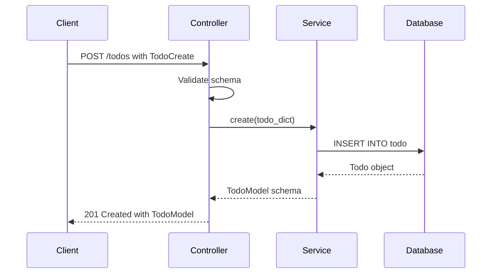

# Todo CRUD Operations Documentation

This document provides comprehensive documentation for the Todo CRUD (Create, Read, Update, Delete) operations in the application's Todo Domain. The todo system is built using Litestar framework with SQLAlchemy ORM and follows domain-driven design principles.

## Table of Contents

1. [Todo Model Structure](#todo-model-structure)
2. [Database Relationships](#database-relationships)
3. [Todo Schemas and DTOs](#todo-schemas-and-dtos)
4. [Todo Service Implementation](#todo-service-implementation)
5. [Todo Controllers and API Endpoints](#todo-controllers-and-api-endpoints)
6. [CRUD Operations Workflows](#crud-operations-workflows)
7. [Validation and Business Rules](#validation-and-business-rules)
8. [Error Handling](#error-handling)
9. [Tag Management](#tag-management)
10. [Time Conflict Detection](#time-conflict-detection)
11. [Database Queries and Performance](#database-queries-and-performance)

## Todo Model Structure

The Todo model is defined in `src/app/db/models/todo.py` and extends `UUIDAuditBase`, providing built-in fields for auditing (created_at, updated_at, etc.).

### Core Attributes

| Field | Type | Description | Constraints |
|-------|------|-------------|-------------|
| `id` | UUID | Primary key | Auto-generated |
| `item` | String(100) | Todo title/title | Required, Indexed |
| `description` | String(1024) | Detailed description | Optional |
| `created_time` | DateTime | Creation timestamp | Auto-generated (UTC) |
| `alarm_time` | DateTime | Reminder/alarm time | Optional |
| `start_time` | DateTime | Planned start time | Required |
| `end_time` | DateTime | Planned end time | Required |
| `importance` | Importance enum | Priority level | Default: NONE |
| `user_id` | UUID | Foreign key to User | Required, Indexed |

### Importance Levels

```python
class Importance(enum.Enum):
    NONE = "none"
    LOW = "low"
    MEDIUM = "medium"
    HIGH = "high"
```

### Model Definition

```python
class Todo(UUIDAuditBase):
    """Todo item"""

    __tablename__ = "todo"
    __table_args__ = {"comment": "Todo items"}
    __pii_columns__ = {"item", "created_time", "alarm_time",
                       "content", "user", "importance", "tags"}

    item: Mapped[str] = mapped_column(
        String(length=100), index=True, nullable=False)
    description: Mapped[str] = mapped_column(
        String(length=1024), nullable=True)
    created_time: Mapped[datetime] = mapped_column(
        default=lambda: datetime.now(UTC), nullable=False)
    alarm_time: Mapped[datetime | None] = mapped_column(nullable=True)
    importance: Mapped[Importance] = mapped_column(
        Enum(Importance, name="importance_enum", native_enum=False),
        nullable=False, default=Importance.NONE)
    user_id: Mapped[UUID] = mapped_column(
        ForeignKey("user_account.id", ondelete="CASCADE"), nullable=False)
    start_time: Mapped[datetime] = mapped_column(nullable=False)
    end_time: Mapped[datetime] = mapped_column(nullable=False)
```

## Database Relationships

### User Relationship
- **One-to-Many**: One User can have many Todos
- **Cascade**: `all, delete-orphan` - todos are deleted when user is deleted
- **Loading Strategy**: `joined` with inner join for performance

```python
user: Mapped[User] = relationship(
    back_populates="todos", lazy="joined", uselist=False, innerjoin=True
)
```

### Tag Relationships
The todo system uses a many-to-many relationship with tags through an association table:

```python
# Direct relationship to association table
todo_tags: Mapped[list[TodoTag]] = relationship(
    back_populates="todo", lazy="selectin", uselist=True, cascade="all, delete-orphan"
)

# Association proxy for convenient tag access
tags: AssociationProxy[list[Tag]] = association_proxy("todo_tags", "tag")
```

### Association Table (TodoTag)

```python
class TodoTag(UUIDAuditBase):
    """Todo Tag - Association table"""

    __tablename__ = "user_account_todo_tag"
    todo_id: Mapped[UUID] = mapped_column(ForeignKey("todo.id", ondelete="cascade"))
    tag_id: Mapped[UUID] = mapped_column(ForeignKey("tag.id", ondelete="cascade"))

    # Relationships
    todo: Mapped[Todo] = relationship(back_populates="todo_tags", innerjoin=True)
    tag: Mapped[Tag] = relationship(back_populates="tag_todos", innerjoin=True)

    # Association proxies for convenience
    todo_item: AssociationProxy[str] = association_proxy("todo", "item")
    tag_name: AssociationProxy[str] = association_proxy("tag", "name")
```

## Todo Schemas and DTOs

Schemas are defined in `src/app/domain/todo/schemas.py` using Pydantic for validation and serialization.

### Base Schema Configuration

All schemas extend `PydanticBaseModel` which provides:
- Camel case conversion for API responses
- `to_dict()` method for model conversion
- `populate_by_name=True` for flexible input handling

### TodoModel (Response Schema)

```python
class TodoModel(PydanticBaseModel):
    id: UUID
    item: str
    description: str | None = None
    created_time: datetime
    alarm_time: datetime | None = None
    start_time: datetime
    end_time: datetime
    importance: Importance
    user_id: UUID
    tags: list[str] | None = None

    @field_validator("tags", mode="before")
    @classmethod
    def _extract_tag_names(cls, value: Any) -> list[str] | None:
        """Extract tag names from ORM proxy or various input formats."""
        if value is None:
            return None

        if isinstance(value, str):
            return [value]

        if not isinstance(value, Iterable):
            return value

        extracted: list[str] = []
        for item in value:
            name = getattr(item, "name", None)
            extracted.append(name if isinstance(name, str) else str(item))

        return extracted
```

### TodoCreate (Creation Schema)

```python
class TodoCreate(PydanticBaseModel):
    item: str                                    # Required
    description: str | None = None               # Optional
    alarm_time: datetime | None = None           # Optional
    start_time: datetime                         # Required
    end_time: datetime                           # Required
    importance: Importance = Importance.NONE      # Default value
    tags: list[str] | None = None               # Optional
```

### TodoUpdate (Update Schema)

```python
class TodoUpdate(PydanticBaseModel):
    item: str | None = None
    description: str | None = None
    alarm_time: datetime | None = None
    start_time: datetime | None = None
    end_time: datetime | None = None
    importance: Importance | None = None
    tags: list[str] | None = None
```

### Tag Schemas

```python
class TagModel(PydanticBaseModel):
    id: UUID
    name: str
    color: str | None = None
    user_id: UUID

class TagCreate(PydanticBaseModel):
    name: str
    color: str | None = None
    todo_id: UUID | None = None  # Optional: associate with todo on creation
```

## Todo Service Implementation

The `TodoService` in `src/app/domain/todo/services.py` handles all database operations using the Advanced Alchemy repository pattern.

### Service Structure

```python
class TodoService(SQLAlchemyAsyncRepositoryService[m.Todo]):
    """Handles database operations for todo."""

    class Repository(SQLAlchemyAsyncRepository[m.Todo]):
        """Todo SQLAlchemy Repository."""
        model_type = m.Todo

    repository_type = Repository
    match_fields = ["item"]  # Fields used for matching in get_or_create
```

### Key Service Methods

#### Get Todo by ID with User Validation

```python
async def get_todo_by_id(self, todo_id: UUID, user_id: UUID) -> m.Todo | None:
    """Get a todo item by ID for the specified user."""
    todo = await self.get_one_or_none(
        m.Todo.id == todo_id,
        m.Todo.user_id == user_id
    )
    if not todo:
        return None
    return todo
```

#### Time Conflict Detection

```python
async def check_time_conflict(
    self,
    user_id: UUID,
    start_time: datetime,
    end_time: datetime,
    exclude_todo_id: UUID | None = None
) -> list[m.Todo]:
    """Check for time conflicts with existing todos for a user.

    Args:
        user_id: The user's UUID
        start_time: The start time to check for conflicts
        end_time: The end time to check for conflicts
        exclude_todo_id: Optional todo ID to exclude from conflict checking

    Returns:
        List of conflicting Todo objects, empty if no conflicts
    """
    filters = [
        m.Todo.user_id == user_id,
        m.Todo.start_time < end_time,  # overlapping condition 1
        m.Todo.end_time > start_time,  # overlapping condition 2
    ]

    if exclude_todo_id:
        filters.append(m.Todo.id != exclude_todo_id)

    conflicts, _ = await self.list_and_count(*filters)
    return list(conflicts)
```

### Tag Service

```python
class TagService(SQLAlchemyAsyncRepositoryService[m.Tag]):
    """Handles database operations for tags."""

    repository_type = TagRepository
    match_fields = ["name"]

    async def get_or_create_tag(
        self,
        user_id: UUID,
        name: str,
        color: str | None = None
    ) -> m.Tag:
        """Get existing tag or create a new one for the user."""
        existing_tag = await self.get_one_or_none(
            m.Tag.user_id == user_id,
            m.Tag.name == name
        )

        if existing_tag:
            return existing_tag

        return await self.create({
            "name": name,
            "color": color,
            "user_id": user_id
        })
```

## Todo Controllers and API Endpoints

Controllers are defined in `src/app/domain/todo/controllers/todos.py` and provide RESTful API endpoints.

### Controller Configuration

```python
class TodoController(Controller):
    """Controller for managing todo items."""

    tags = ["Todo"]
    path = "/todos"

    dependencies = {
        "todo_service": Provide(provide_todo_service),
        "tag_service": Provide(provide_tag_service),
    } | create_filter_dependencies({
        "id_filter": UUID,
        "search": "item",
        "pagination_type": "limit_offset",
        "pagination_size": 40,
        "created_at": True,
        "updated_at": True,
        "sort_field": "created_time",
        "sort_order": "asc",
    })
```

### API Endpoints

#### List Todos

```python
@get(path="/", operation_id="list_todos")
async def list_todos(
    self,
    current_user: m.User,
    todo_service: TodoService,
    filters: Annotated[list[FilterTypes], Dependency(skip_validation=True)],
    start_time_from: Annotated[datetime | None, Parameter(
        query="start_time_from",
        description="Filter todos with start_time after this datetime"
    )] = None,
    start_time_to: Annotated[datetime | None, Parameter(
        query="start_time_to",
        description="Filter todos with start_time before this datetime"
    )] = None,
    end_time_from: Annotated[datetime | None, Parameter(
        query="end_time_from",
        description="Filter todos with end_time after this datetime"
    )] = None,
    end_time_to: Annotated[datetime | None, Parameter(
        query="end_time_to",
        description="Filter todos with end_time before this datetime"
    )] = None,
) -> OffsetPagination[TodoModel]:
    """List all todo items with optional time filtering."""
    user_filter = m.Todo.user_id == current_user.id
    additional_filters = []

    # Add custom datetime filters
    if start_time_from:
        additional_filters.append(m.Todo.start_time >= start_time_from)
    if start_time_to:
        additional_filters.append(m.Todo.start_time <= start_time_to)
    if end_time_from:
        additional_filters.append(m.Todo.end_time >= end_time_from)
    if end_time_to:
        additional_filters.append(m.Todo.end_time <= end_time_to)

    all_filters = [user_filter] + additional_filters + list(filters)
    results, total = await todo_service.list_and_count(*all_filters)
    return todo_service.to_schema(
        data=results,
        total=total,
        schema_type=TodoModel,
        filters=filters
    )
```

#### Create Todo

```python
@post(path="/", operation_id="create_todo")
async def create_todo(
    self,
    current_user: m.User,
    data: TodoCreate,
    todo_service: TodoService
) -> TodoModel:
    """Create a new todo item."""
    todo_dict = data.to_dict()
    todo_dict["user_id"] = current_user.id
    todo_model = await todo_service.create(todo_dict)
    return todo_service.to_schema(todo_model, schema_type=TodoModel)
```

#### Get Single Todo

```python
@get(path="/{todo_id:uuid}", operation_id="get_todo")
async def get_todo(
    self,
    todo_id: UUID,
    todo_service: TodoService
) -> TodoModel | str:
    """Get a specific todo item by ID."""
    try:
        todo = await todo_service.get(todo_id)
        if not todo:
            return f"Todo item {todo_id} not found."
        return todo_service.to_schema(todo, schema_type=TodoModel)
    except (ValueError, RuntimeError, AttributeError) as e:
        return f"Error retrieving todo item {todo_id}: {e!s}"
```

#### Update Todo

```python
@patch(path="/{todo_id:uuid}", operation_id="update_todo")
async def update_todo(
    self,
    todo_id: UUID,
    data: TodoCreate,  # Note: Uses TodoCreate schema
    todo_service: TodoService
) -> str | TodoModel:
    """Update a specific todo item by ID."""
    todo = await todo_service.get(todo_id)
    if not todo:
        return f"Todo item {todo_id} not found."

    todo_dict = data.to_dict()
    updated_todo = await todo_service.update(todo, **todo_dict)
    return todo_service.to_schema(updated_todo, schema_type=TodoModel)
```

#### Delete Todo

```python
@delete(path="/{todo_id:uuid}", operation_id="delete_todo", status_code=200)
async def delete_todo(
    self,
    todo_id: UUID,
    todo_service: TodoService
) -> str | TodoModel:
    """Delete a specific todo item by ID."""
    try:
        todo = await todo_service.get(todo_id)
        if not todo:
            return f"Todo item {todo_id} not found."

        await todo_service.delete(todo_id)
        return todo_service.to_schema(todo, schema_type=TodoModel)
    except (ValueError, RuntimeError, AttributeError) as e:
        return f"Error deleting todo item {todo_id}: {e!s}"
```

## CRUD Operations Workflows

### Create Todo Workflow

1. **Request Validation**: Pydantic validates input data against `TodoCreate` schema
2. **Authentication**: Current user is injected via dependency injection
3. **Data Preparation**: User ID is added to todo data
4. **Database Operation**: Service creates todo record using repository pattern
5. **Response Serialization**: Todo model is converted to `TodoModel` schema
6. **Response**: Serialized todo data returned to client



### Read Todo Workflow

1. **Parameter Extraction**: Todo UUID extracted from URL path
2. **Database Query**: Service retrieves todo by primary key
3. **Authorization**: User ownership is implicitly enforced through service layer
4. **Serialization**: Todo converted to response schema
5. **Response**: Todo data or error message returned

### Update Todo Workflow

1. **Todo Retrieval**: Existing todo fetched from database
2. **Validation**: Input data validated against `TodoCreate` schema
3. **Data Update**: Service applies partial updates using repository
4. **Response**: Updated todo data returned

### Delete Todo Workflow

1. **Todo Retrieval**: Existing todo fetched to ensure it exists
2. **Deletion**: Service deletes todo using repository
3. **Cascading**: Related `TodoTag` records are automatically deleted
4. **Response**: Success confirmation with deleted todo data

## Validation and Business Rules

### Schema-Level Validation

1. **Required Fields**: `item`, `start_time`, `end_time` are mandatory
2. **Type Validation**: All fields are strictly typed with Pydantic
3. **Enum Validation**: `importance` must be valid `Importance` enum value
4. **Tag Processing**: Tags are normalized to string list format

### Database-Level Constraints

1. **Foreign Key**: `user_id` must reference existing user
2. **Cascading Deletes**: Related `TodoTag` records deleted automatically
3. **Not Null**: Required fields enforced at database level

### Business Logic Rules

1. **Time Validation**: While not explicitly validated in current implementation, `start_time` should typically be before `end_time`
2. **User Isolation**: Users can only access their own todos through service methods
3. **Time Conflict Detection**: Service provides method to detect overlapping todos (though not enforced automatically)

## Error Handling

### Controller-Level Error Handling

```python
try:
    todo = await todo_service.get(todo_id)
    # ... operation logic
except (ValueError, RuntimeError, AttributeError) as e:
    return f"Error retrieving todo item {todo_id}: {e!s}"
```

### Common Error Scenarios

1. **Todo Not Found**: Returns descriptive error message with todo ID
2. **Validation Errors**: Pydantic automatically returns 400 Bad Request with details
3. **Database Errors**: Caught and returned as user-friendly messages
4. **Permission Errors**: Handled through service layer (user-scoped queries)

### Response Format

- **Success**: Returns `TodoModel` schema with HTTP 200/201
- **Error**: Returns string error message with appropriate HTTP status
- **Not Found**: Returns descriptive error message

## Tag Management

### Create Tag Workflow

```python
@post(path="/create_tag", operation_id="create_tag")
async def create_tag(
    self,
    current_user: m.User,
    data: TagCreate,
    tag_service: TagService,
    todo_service: TodoService
) -> TagModel:
    """Create a new tag."""
    # Get or create tag (idempotent operation)
    tag_model = await tag_service.get_or_create_tag(
        current_user.id,
        data.name,
        data.color
    )

    # Associate with todo if todo_id provided
    current_todo_uuid = data.todo_id
    if current_todo_uuid:
        todo_tag = m.TodoTag(
            todo_id=current_todo_uuid,
            tag_id=tag_model.id
        )
        current_todo = await todo_service.get(current_todo_uuid)
        if current_todo:
            current_todo.todo_tags.append(todo_tag)

    return tag_service.to_schema(tag_model, schema_type=TagModel)
```

### Tag Features

1. **Idempotent Creation**: `get_or_create_tag` prevents duplicate tags
2. **User Isolation**: Tags are scoped to individual users
3. **Optional Association**: Tags can be created independently or linked to todos
4. **Color Support**: Tags support optional color coding

### List Tags

```python
@get(path="/tags", operation_id="list_tags")
async def list_tags(
    self,
    current_user: m.User,
    tag_service: TagService,
    filters: Annotated[list[FilterTypes], Dependency(skip_validation=True)]
) -> OffsetPagination[TagModel]:
    """List all tags for the current user."""
    user_filter = m.Tag.user_id == current_user.id
    results, total = await tag_service.list_and_count(user_filter, *filters)
    return tag_service.to_schema(
        data=results,
        total=total,
        schema_type=TagModel,
        filters=filters
    )
```

### Delete Tag

```python
@delete(path="/delete_tag/{tag_id:uuid}", operation_id="delete_tag", status_code=200)
async def delete_tag(
    self,
    tag_id: UUID,
    current_user: m.User,
    tag_service: TagService
) -> str | TagModel:
    """Delete a specific tag by ID."""
    tag = await tag_service.get_one_or_none(
        m.Tag.id == tag_id,
        m.Tag.user_id == current_user.id
    )
    if not tag:
        return f"Tag {tag_id} not found or does not belong to the user."

    await tag_service.delete(tag)
    return tag_service.to_schema(tag, schema_type=TagModel)
```

## Time Conflict Detection

The service provides sophisticated time conflict detection to prevent scheduling overlapping todos.

### Conflict Detection Logic

Two time ranges overlap if:
1. The new `start_time` is before existing `end_time` AND
2. The new `end_time` is after existing `start_time`

```python
# Overlap condition visualization
# Existing:    |--------|
# New:      |--------|  → Overlaps (new.start < existing.end AND new.end > existing.start)

# Existing: |--------|
# New:               |--------|  → No overlap (new.start >= existing.end)

# Existing:         |--------|
# New:      |--------|           → No overlap (new.end <= existing.start)
```

### Usage Example

```python
# Check for conflicts when creating a new todo
conflicts = await todo_service.check_time_conflict(
    user_id=current_user.id,
    start_time=new_todo.start_time,
    end_time=new_todo.end_time
)

if conflicts:
    # Handle conflicts - inform user or prevent creation
    conflicting_items = [todo.item for todo in conflicts]
    raise ValueError(f"Time conflicts with: {', '.join(conflicting_items)}")
```

## Database Queries and Performance

### Efficient Query Loading

Service dependencies are configured with optimized loading strategies:

```python
# Todo service dependency configuration
provide_todo_service = create_service_provider(
    TodoService,
    load=[
        # Eager load todo tags with their associated tags
        selectinload(m.Todo.todo_tags).options(
            joinedload(m.TodoTag.tag, innerjoin=True)
        ),
        # Eager load user with inner join
        joinedload(m.Todo.user, innerjoin=True),
    ],
    error_messages={
        "duplicate_key": "This user already exists.",
        "integrity": "User operation failed.",
    }
)
```

### Loading Strategies Explained

1. **joinedload**: Uses SQL JOIN to load related data in single query
   - Used for User relationship (always needed for todos)
   - Inner join ensures user always exists

2. **selectinload**: Uses separate query with IN clause
   - Used for TodoTag relationships (variable count)
   - More efficient for collection relationships

### Database Indexes

- `user_id`: Foreign key indexed for user-scoped queries
- `item`: Indexed for search functionality
- Primary key: UUID indexed by default

### Pagination

List endpoints support limit-offset pagination with configurable page size (default: 40).

```python
# Automatic pagination via Advanced Alchemy
results, total = await todo_service.list_and_count(*all_filters)
return todo_service.to_schema(
    data=results,
    total=total,
    schema_type=TodoModel,
    filters=filters
)
```

### Query Optimization Tips

1. **User Scoping**: Always include `user_id` filter to prevent cross-user data access
2. **Time Range Filtering**: Add indexes on `start_time` and `end_time` for time-based queries
3. **Tag Filtering**: Use association table joins for efficient tag-based filtering
4. **Select Only Needed Fields**: Consider projection for large result sets

## Integration with AI Agent System

The todo system integrates with AI agents through a separate controller (`TodoAgentController`) that provides:

1. **Natural Language Todo Creation**: AI-powered todo creation from natural language input
2. **Session Management**: Persistent conversation sessions for context
3. **Streaming Responses**: Real-time agent responses via Server-Sent Events
4. **Usage Tracking**: Rate limiting and quota management for AI operations

### Agent Endpoints

- `POST /agent-create` - Create todos using AI agent
- `POST /agent-create/stream` - Stream agent responses
- `GET /agent-sessions` - List active agent sessions
- `GET /usage-stats` - Get AI usage statistics

These endpoints extend the basic CRUD functionality with AI-powered natural language processing while maintaining the same underlying todo model and business logic.

## Security Considerations

1. **User Isolation**: All queries are scoped to current user
2. **Input Validation**: Pydantic schemas provide comprehensive validation
3. **SQL Injection Protection**: SQLAlchemy ORM prevents SQL injection
4. **Authorization**: JWT-based authentication required for all operations
5. **PII Protection**: Sensitive fields marked in model for compliance

## Best Practices for Developers

1. **Always Use Service Layer**: Don't bypass service layer for database operations
2. **Validate Time Ranges**: Ensure `start_time` < `end_time` when creating todos
3. **Check for Conflicts**: Use `check_time_conflict` method for scheduling
4. **Handle Tags Properly**: Use tag service for tag operations
5. **Error Handling**: Implement proper error handling in client applications
6. **Pagination**: Use pagination for large todo lists
7. **Filtering**: Leverage built-in filtering capabilities for efficient queries

This documentation provides a comprehensive overview of the Todo CRUD operations. For specific implementation details or advanced use cases, refer to the source code in the respective modules.